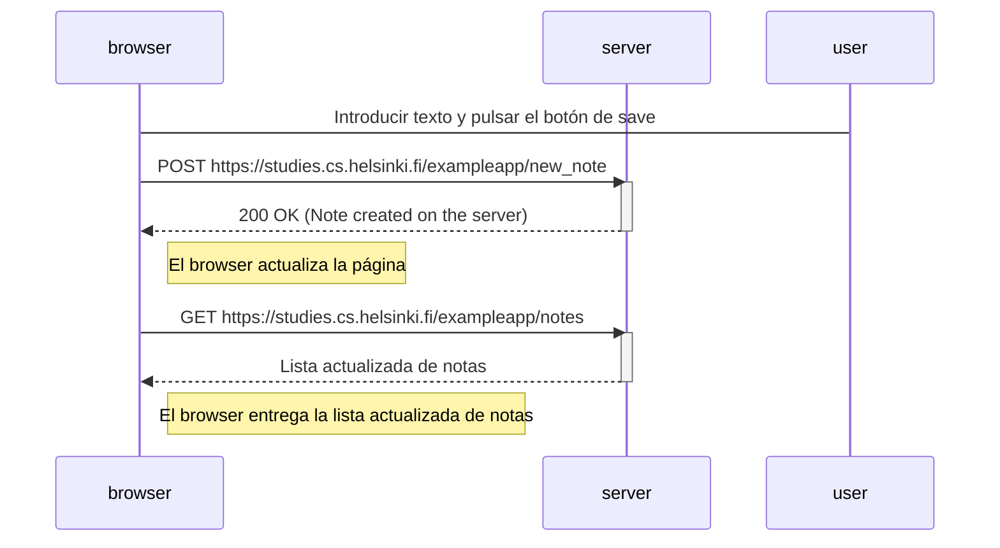

```mermaid
sequenceDiagram
    participant browser
    participant server
    participant user

    user->browser: Introducir texto y pulsar el botón de save
    browser->>server: POST https://studies.cs.helsinki.fi/exampleapp/new_note
    activate server
    server-->>browser: 200 OK (Note created on the server)
    deactivate server

    Note right of browser: El browser actualiza la página

    browser->>server: GET https://studies.cs.helsinki.fi/exampleapp/notes
    activate server
    server-->>browser: Lista actualizada de notas
    deactivate server

    Note right of browser: El browser entrega la lista actualizada de notas
```