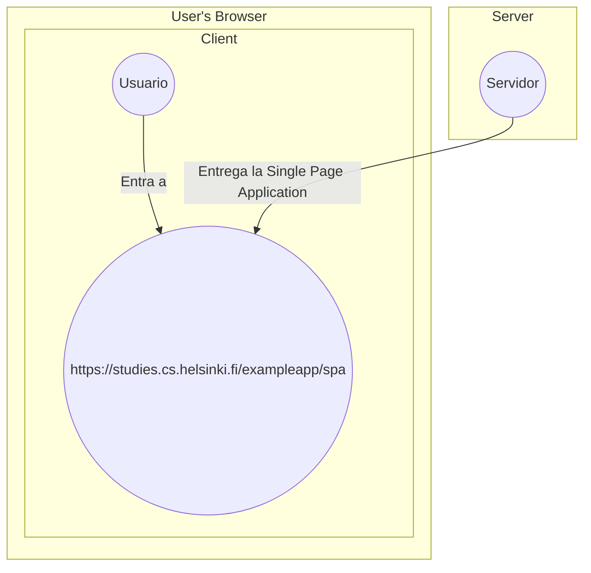

```mermaid
graph TD
    subgraph User's Browser
        subgraph Client
            user((Usuario))
            user -->|Entra a| spa((https://studies.cs.helsinki.fi/exampleapp/spa))
        end
    end
    subgraph Server
        server((Servidor))
        server -->|Entrega la Single Page Application| spa((https://studies.cs.helsinki.fi/exampleapp/spa))
    end
```