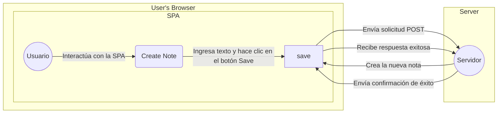

```mermaid
graph LR
    subgraph User's Browser
        subgraph SPA
            user((Usuario))
            user -->|Interactúa con la SPA| create(Create Note)
            create -->|Ingresa texto y hace clic en el botón Save| save
        end
    end
    subgraph Server
        server((Servidor))
        save -->|Envía solicitud POST| server
        server -->|Crea la nueva nota| save
        save -->|Recibe respuesta exitosa| server
        server -->|Envía confirmación de éxito| save
    end
```